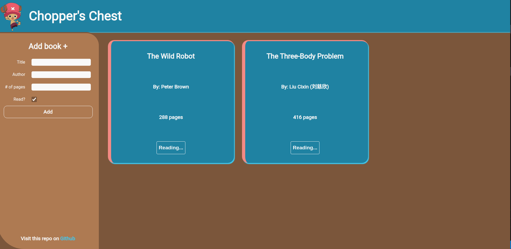

Library Project

From The Odin Project: JavaScript Library Lesson

This is a quick project, but I took my sweet time polishing it so it’s as pretty as it is functional.

Objects, Constructor & Prototypal Inheritance

The core challenge here was to understand how to use an object constructor to create a Book.prototype for each new book instance.

This not only simplifies the task of creating books but also leaves your code readable and easy to follow. With clear structuring and naming conventions, you can quickly see what each piece is doing thanks to prototypal inheritance.

This approach allows for smooth scalability whenever a new feature is added. The focus isn’t just on tracking values, but understanding the scope of each Book instance and maintaining strict logical flow.

This allowed me to easily add the event listeners for delete button and toggle button. The scope of displayBook() function lets it know which isntance of the book it is working with and the use of findIndex() helps tackle the specific Book property. Allowing for a simple function that either deletes a book or toggles its read status between true and false:

I like to think of prototypal inheritance as an infinite set of motherboards with labels:

insert your title here

insert your author there

…and so on.

Fun Factor & Aesthetics

I had a blast building this project, and it even inspired me to go a bit further to make it look as good as it works.

While I’ll stick to logic-first on future Odin projects, it feels amazing to see a project function and look great at the same time.

Peace,
Max ✌️
